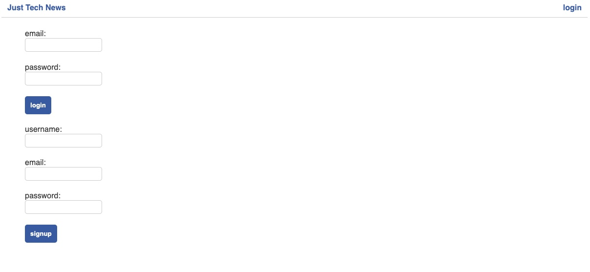
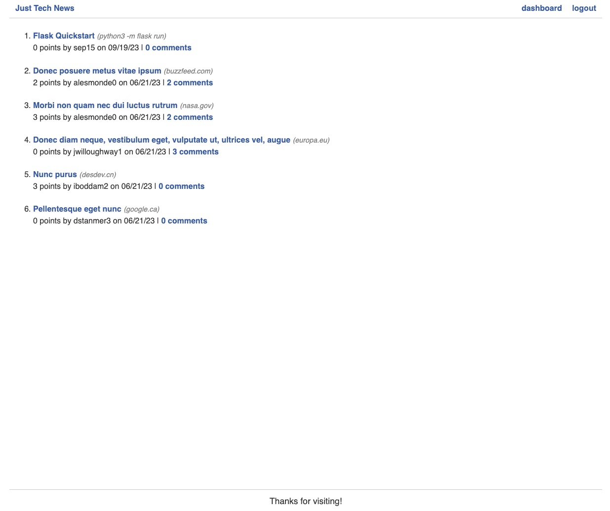
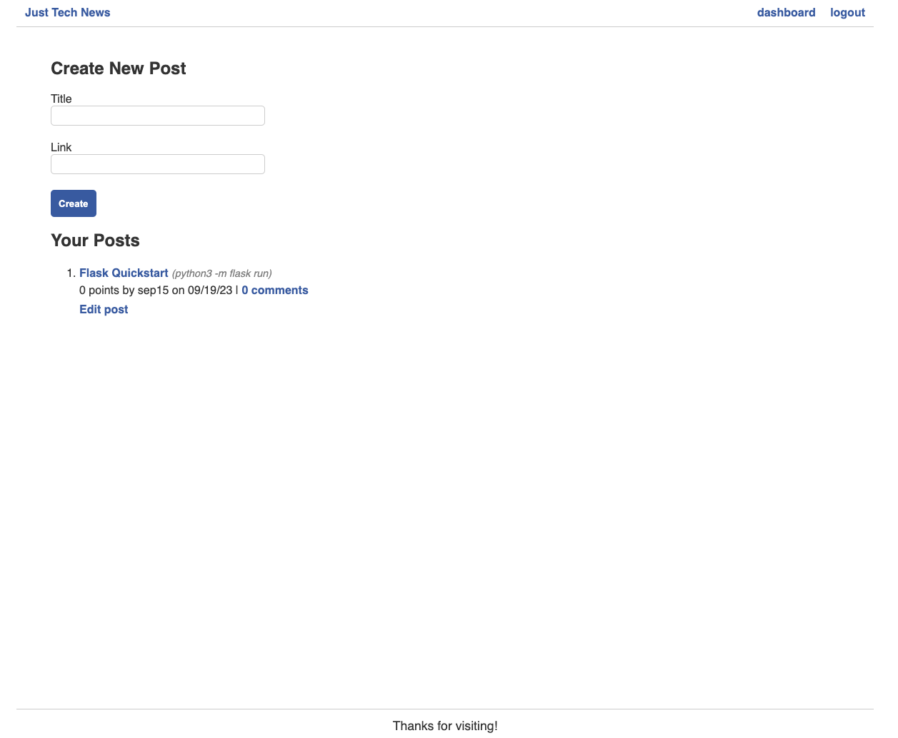

## Python - News Feed

News Feed application - a website where users can post, upvote, and comment on links to news articles. 

-[Repository](https://github.com/luksvrd/Rally)

-[Deployed](https://ljv-python-newsfeed-af7bd51bba2f.herokuapp.com/)





## Table of Contents

### \* [Description](#description)

### \* [Installation](#installation)

### \* [Future Development](#Future-Development)

### \* [Features](#Features)

### \* [Questions](#questions)

### \* [Contributors](#contributors)

## Description

Originally, this app was built using Node.js and I used Python to refactor/create the app and the Python Flask framework to create the application's views. The work involved connecting to a relational database using SQLAlchemy, providing user authentication using Flask's built-in session functionality, and was deploying to the cloud using Heroku.

Upon completing this exercise, I learned how to:

- Build and deploy to the cloud a Flask API with correct project structure and necessary dependencies.

- Connect the application to an RDBMS database using SQL Alchemy to support the API model.

- Create a REST API that performs CRUD operations.

- Set up and configure a local virtual environment for Python Flask.

- Explain the differences between JavaScript and Python.

- Add templating to the application to allow for user interactions.

- Perform basic DevOps and deploy to a cloud infrastructure.

# User Story


**Issue:** Set up app to render templates

* As a user, I want to be able to view the home and dashboard pages in the browser

**Issue:** Set up database and models

* As a user, I need a database that can store my account, posts, comments, or upvotes

**Issue:** Finalize homepage views with data and filters

* As a user, I want to be able to see my posts on the homepage

* I expect to see dates, URLs, and plural words properly formatted

**Issue:** Implement user logins and sessions

* As a user, I want to be able to log in and have my session remembered if I refresh the page

**Issue:** Build and safeguard remaining routes

* As a logged-in user, I want to be able to create new posts and comments and upvote other posts

**Issue:** Deploy the app

* As a user, I want to be able to visit the app on a public URL

## Installation

This application assumes you have a 'complete dev environment' setup - a terminal and an IDE such as VS Code. However, for this application, you will need Python3 or later. To find out what version is installed on your computer, run `python3 --version` in your terminal. If you have Python 3.4 or later, you're good to go! 
If not, run `brew help` -- if you see an error you need to install the following:
- Apple's Xcode tools (`xcode-select --install`) 
- Homebrew (`/bin/bash -c "$(curl -fsSL https://raw.githubusercontent.com/Homebrew/install/master/install.sh)"`). 

Once you have Homebrew installed:
- Run `brew install python3` to install Python 3.4 or later.
    - Finally, confirm that Python 3.4 or later is installed by running `python3 --version` in your terminal.


Create a Virtual Environment:

- In the root directory of the project, run the following command: `python3 -m venv venv`. 
    - The `python -m venv` uses Python's built-in `venv` module to create a new directory. This new directory is called venv and it holds all the files that make a virtual environment possible.
- Activate the virtual environment by running `. venv/bin/activate`. 
    - You'll know that you activated the virtual environment if (venv) appears at the command-line prompt, like in the following example: `venv ~/code/Python/python-newsfeed`
    - As long as the virtual environment is active, installing Python dependencies puts them in this local `venv` directory instead of globally installing them for your entire operating system.
- To deactivate the virtual environment, run the `deactivate` command from any directory

Congrats! You're now set up to start developing a Python back end. Next, you'll install your first dependency to get the web server up and running. Just as Node.js has `npm`, Python has `pip` to manage dependencies. However, we need to ensure that the virtual environment is running so that dependencies get put into the right place. 
- `. venv/bin/activate` to activate the virtual environment
- `pip install flask` to install Flask as the web framework
- `python3 -m flask run` to start the Flask Server (default port 5000)
    - In Python, a package is a directory that can contain other packages or modules. Just the presence of an `__init__.py` file designates the directory as a package, but the file can also contain logic to consolidate submodules, perform startup tasks, and more.
- Install SQLAlchemy, PyMySQL, and python-dotenv dependencies
    - `pip install sqlalchemy pymysql python-dotenv`

- Next, create a `.env` file in the root directory of the project and add the following code to it (change `<password>` to your actual password):
```sql
DB_URL=mysql+pymysql://root:<password>@localhost/python_news_db
```

- Install dependencies for password hashing and encryption
    - `pip install bcrypt cryptography` to install bcrypt and cryptography dependencies 

- Install dependencies for deployment to Heroku
    - `pip install gunicorn` to install gunicorn 

- Create a Procfile in the root directory to specify commands Heroku should run to start the web server. Add the following line to the Procfile:
```python
    web: gunicorn -w 4 "app:create_app()" -t 120
```
- Create a Requirements File for Dependencies 
    - `pip freeze > requirements.txt` to create a requirements.txt file that lists all the dependencies for the project

## Future Development

Ongoing goals in development include:

- Adding style to the application
- More content on the homepage (blog posts, etc.)
- Adding a profile page for each user

## Features

- A database that can store accounts, posts, comments, or upvotes.
- Ability to see dates, URLs, and plural words properly formatted.
- Ability to log in and have sessions remembered upon refreshing the page.
- Ability to create new posts and comments and upvote other posts.

## Questions

If you have any questions about the repo, open an [issue](https://github.com/luksvrd/python-newsfeed/issues). You can also find more of my work on [Github](https://github.com/luksvrd).

## Credits

Credit to edX Boot Camps LLC for the starter code and continued education modules.

## Contributors

Contributors: Lukas Virden

